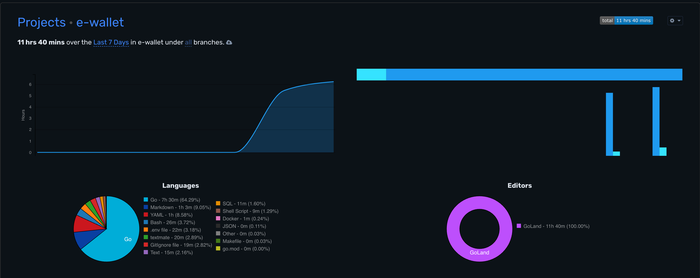

# E-Wallet API

REST API for electronic wallet services with HMAC-SHA1 authentication.

## 📋 Task

**Project Goal:**

Implement a REST API for a financial institution that provides electronic wallet services to its partners. The system
supports two types of wallet accounts: **identified** and **unidentified**.

**Requirements:**

- API must support multiple clients
- Use only HTTP POST methods with JSON format
- `X-Digest` is HMAC-SHA1 hash of request body
- Pre-populate wallets with different balances
- Maximum balance: **10,000 TJS** for unidentified, **100,000 TJS** for identified accounts

**API Methods:**
1. Check if wallet account exists
2. Deposit to wallet
3. Get total count and amount of deposits for current month
4. Get wallet balance

**Full task description:** [docs/task.txt](docs/task.txt)

## 🚀 Quick Start

### Prerequisites

- Docker & Docker Compose
- Go 1.21+
- PostgreSQL client (`psql`)

### Installation

1. **Clone repository**
   ```bash
   git clone git@github.com:shyn1ck/e-wallet.git
   cd e-wallet
   ```

2. **Setup configuration**
   ```bash
   cp .env.example .env
   cp configs/config.yaml.example configs/config.yaml
   ```

3. **Start development**
   ```bash
   ./scripts/manage.sh dev
   ```

**Access:**
- API: http://localhost:8080
- Swagger: http://localhost:8080/swagger/index.html
- Health: http://localhost:8080/health

### Production Mode

```bash
# Start all services in Docker
./scripts/manage.sh prod
```

### Run API Tests

```bash
# In another terminal
./scripts/manage.sh test
```

## 🛠 Tech Stack

- **Go 1.21+** - Programming language
- **Gin** - HTTP web framework
- **GORM** - ORM for database operations
- **PostgreSQL 16** - Primary database
- **Redis 7** - Caching layer for API clients
- **Docker & Docker Compose** - Containerization
- **Swagger** - API documentation (dev mode only)

## 🏗 Architecture

**Clean Architecture** with clear separation of concerns:

```
internal/
├── domain/          # Business logic (independent layer)
│   ├── entity/      # Domain entities (Wallet, Transaction, APIClient)
│   ├── valueobject/ # Value objects (AccountID, Money, WalletType)
│   ├── repository/  # Repository interfaces
│   └── service/     # Domain services (BalanceValidator)
├── usecase/         # Application business rules
├── infrastructure/  # External dependencies (DB, Redis, Config)
├── delivery/        # HTTP handlers and middleware
└── dto/            # Request/Response DTOs
```

**Key Features:**

- Clean Architecture
- HMAC-SHA1 authentication
- Redis caching for performance
- Transaction support
- Comprehensive error handling

## 📡 API Endpoints

All endpoints require HMAC authentication via headers:

- `X-UserId`: Client identifier (e.g., `alif_partner`)
- `X-Digest`: HMAC-SHA1 signature of request body

### 1. Check Wallet Existence

```http
POST /api/v1/wallet/check
Content-Type: application/json
X-UserId: alif_partner
X-Digest: <hmac-sha1-signature>

{"account_id":"992900123456"}
```

### 2. Deposit to Wallet

```http
POST /api/v1/wallet/deposit
Content-Type: application/json
X-UserId: alif_partner
X-Digest: <hmac-sha1-signature>

{"account_id":"992900123456","amount":10000}
```

*Amount in dirams (10000 dirams = 100 TJS)*

### 3. Get Wallet Balance

```http
POST /api/v1/wallet/balance
Content-Type: application/json
X-UserId: alif_partner
X-Digest: <hmac-sha1-signature>

{"account_id":"992900123456"}
```

### 4. Get Monthly Statistics

```http
POST /api/v1/wallet/monthly-stats
Content-Type: application/json
X-UserId: alif_partner
X-Digest: <hmac-sha1-signature>

{"account_id":"992900123456"}
```

> **Note:** All amounts are in **dirams** (1 TJS = 100 dirams)

## 🔐 Authentication

HMAC-SHA1 authentication is required for all API requests.

### HMAC Generator Tool

The project includes a powerful HMAC signature generator tool (`tools/hmac-gen/`) to simplify API testing and
integration.

**Why use this tool?**

- Eliminates manual HMAC-SHA1 calculation errors
- Speeds up API testing workflow
- Provides ready-to-use curl commands
- Supports both interactive and CLI modes

**Quick Start:**

```bash
./scripts/manage.sh hmac
```

**Interactive Mode Features:**

- Pre-configured test credentials (3 clients)
- Select endpoint from menu
- Auto-generates HMAC signature
- Outputs complete curl command

**CLI Mode for Automation:**

```bash
go run tools/hmac-gen/main.go \
  -user alif_partner \
  -secret alif_secret_2025 \
  -endpoint /wallet/balance \
  -body '{"account_id":"992900123456"}'
```

**Output Example:**

```bash
Generated HMAC Signature: a1b2c3d4e5f6...
X-UserId: alif_partner
X-Digest: a1b2c3d4e5f6...

curl -X POST http://localhost:8080/api/v1/wallet/balance \
  -H "Content-Type: application/json" \
  -H "X-UserId: alif_partner" \
  -H "X-Digest: a1b2c3d4e5f6..." \
  -d '{"account_id":"992900123456"}'
```

**Use Cases:**

- Testing API endpoints during development
- Generating signatures for integration
- Debugging authentication issues
- Creating automated test scripts

## 📜 Scripts

All automation scripts are in `scripts/` directory. See [scripts/SCRIPTS.md](scripts/SCRIPTS.md) for full documentation.

### Main Commands

```bash
# Development
./scripts/manage.sh dev      # Start dev environment
./scripts/manage.sh test     # Run API tests
./scripts/manage.sh hmac     # Generate HMAC signatures

# Production
./scripts/manage.sh prod     # Deploy to Docker

# Docker
./scripts/manage.sh up       # Start containers
./scripts/manage.sh down     # Stop containers
./scripts/manage.sh logs     # View logs

# Database
./scripts/manage.sh init     # Initialize database
./scripts/manage.sh seed     # Seed test data
./scripts/manage.sh backup   # Backup database

# Utilities
./scripts/manage.sh swagger  # Generate Swagger docs
./scripts/manage.sh clean    # Clean everything
```

## 🗄 Database

### Pre-seeded Test Data

**API Clients:**

- `alif_partner` / `alif_secret_2025`
- `megafon_api` / `megafon_key_secure`
- `tcell_integration` / `tcell_hmac_key`

**Unidentified Wallets (max 10,000 TJS):**

- `992900123456` - 2,500 TJS
- `992935789012` - 5,000 TJS
- `992918765432` - 7,500 TJS
- `992987654321` - 10,000 TJS
- `992901234567` - 0 TJS

**Identified Wallets (max 100,000 TJS):**

- `992900111222` - 25,000 TJS
- `992935333444` - 50,000 TJS
- `992918555666` - 75,000 TJS
- `992987777888` - 100,000 TJS
- `992901999000` - 0 TJS

## 🔧 Configuration

### Environment Variables (`.env`)

```bash
APP_ENVIRONMENT=development  # or production
POSTGRES_PASSWORD=postgres
REDIS_PASSWORD=              # optional
```

### Config File (`configs/config.yaml`)

Base configuration with environment variable overrides:

- `APP_ENVIRONMENT` overrides `app.environment`
- `POSTGRES_PASSWORD` overrides `database.password`
- `REDIS_PASSWORD` overrides `redis.password`

## 🐳 Docker

### Development Mode

- **Containers:** PostgreSQL + Redis only
- **App:** Runs locally with `go run`
- **Swagger:** Enabled at `/swagger/index.html`
- **Hot Reload:** Restart app anytime

### Production Mode

- **Containers:** PostgreSQL + Redis + App
- **Swagger:** Disabled
- **Auto-restart:** Enabled
- **Health checks:** Configured

## 📚 Documentation

- **Scripts Guide:** [scripts/SCRIPTS.md](scripts/SCRIPTS.md) - Complete automation documentation
- **Swagger UI:** http://localhost:8080/swagger/index.html (dev mode only)
- **HMAC Generator:** `tools/hmac-gen/` - Interactive tool for generating HMAC-SHA1 signatures with pre-configured test credentials and ready-to-use curl commands

## ✅ Testing

### Automated Tests

```bash
./scripts/manage.sh test
```

**Test Coverage:**

- ✅ Check wallet existence (valid)
- ✅ Check non-existent wallet
- ✅ Get wallet balance
- ✅ Deposit to wallet
- ✅ Get monthly statistics
- ✅ Deposit exceeding limit (should fail)
- ✅ Invalid amount (should fail)
- ✅ Missing authentication (should fail)
- ✅ Invalid HMAC signature (should fail)

### Manual Testing

Use the HMAC generator tool:

```bash
./scripts/manage.sh hmac
```

## 📁 Project Structure

```
.
├── cmd/
│   └── server/
│       └── main.go                    # Application entry point
├── internal/
│   ├── delivery/
│   │   └── http/
│   │       ├── handler/               # HTTP handlers
│   │       ├── middleware/            # Auth, logging, rate limit
│   │       └── router.go
│   ├── domain/
│   │   ├── entity/                    # Core entities
│   │   ├── repository/                # Repository interfaces
│   │   ├── service/                   # Domain services
│   │   └── valueobject/               # Value objects
│   ├── dto/
│   │   ├── request/                   # API requests
│   │   └── response/                  # API responses
│   ├── infrastructure/
│   │   ├── cache/                     # Redis cache
│   │   ├── config/                    # Configuration
│   │   ├── container/                 # DI container
│   │   ├── database/                  # PostgreSQL
│   │   └── logger/                    # Lumberjack logger
│   ├── repository/
│   │   ├── mapper/                    # Entity mappers
│   │   ├── postgres/                  # PostgreSQL repos
│   │   └── redis/                     # Redis repos
│   └── usecase/                       # Business logic
├── pkg/
│   ├── crypto/                        # HMAC implementation
│   ├── errors/                        # Custom errors
│   ├── utils/                         # Utilities
│   └── validator/                     # Input validation
├── scripts/
│   ├── manage.sh                      # Main automation script
│   ├── test-api.sh                    # API tests
│   ├── init.sql                       # DB initialization
│   ├── seed.sql                       # Test data
│   └── SCRIPTS.md                     # Scripts documentation
├── tools/
│   └── hmac-gen/                      # HMAC generator tool
├── docs/
│   ├── task.txt                       # Original task
│   └── swagger.*                      # Swagger docs (auto-generated)
├── configs/
│   ├── config.yaml.example
│   └── config.yaml
├── screens/
│   └── wakatime.png                   # Development time tracking
├── logs/                              # Application logs
├── .env.example
├── docker-compose.yml
├── Dockerfile
├── go.mod
└── README.md
```

## 📊 Logging

The application uses **Lumberjack** for structured logging with automatic log rotation.

**Log Files:**
- `logs/info.log` - General information
- `logs/error.log` - Error messages
- `logs/warn.log` - Warnings
- `logs/debug.log` - Debug information
- `logs/gorm.log` - Database queries

**Configuration:**
- Max size: 30 MB per file
- Max backups: 10 files
- Max age: 365 days
- Compression: Enabled

## 🚦 Development Workflow

1. **Start development environment:**
   ```bash
   ./scripts/manage.sh dev
   ```

2. **Make changes to code**

3. **Restart app** (Ctrl+C and re-run `./scripts/manage.sh dev`)

4. **Test changes:**
   ```bash
   ./scripts/manage.sh test
   ```

5. **View Swagger documentation:**
    - Open http://localhost:8080/swagger/index.html

6. **Check logs:**
   ```bash
   ./scripts/manage.sh logs postgres
   ```

## 🎯 Features

- ✅ Clean Architecture
- ✅ HMAC-SHA1 authentication with Redis caching
- ✅ Two wallet types with balance limits
- ✅ Transaction history and monthly statistics
- ✅ Comprehensive error handling
- ✅ Request ID tracking for debugging
- ✅ Rate limiting (100 requests/minute)
- ✅ Structured logging
- ✅ Docker support (dev + prod)
- ✅ Automated testing
- ✅ Swagger documentation
- ✅ HMAC generator tool

## 🔧 Troubleshooting

### Config file not found

```bash
cp configs/config.yaml.example configs/config.yaml
```

### Port 8080 already in use

```bash
# Find and kill process
lsof -ti:8080 | xargs kill -9
```

### Database connection error

```bash
# Check if PostgreSQL is running
./scripts/manage.sh status

# Restart containers
./scripts/manage.sh restart
```

### Missing .env file

```bash
cp .env.example .env
```

## 📝 Notes

- All monetary amounts are stored in **dirams** (1 TJS = 100 dirams)
- Swagger documentation is only available in **development mode**
- Redis caching improves API client authentication performance
- Database migrations are handled automatically by GORM
- All API methods use **POST** with **JSON** format

## 🔗 Links

- **GitHub Repository:** https://github.com/shyn1ck/e-wallet
- **Scripts Documentation:** [scripts/SCRIPTS.md](scripts/SCRIPTS.md)
- **Task Description:** [docs/task.txt](docs/task.txt)

---

## ⏱ Development Time



*Project development tracked with WakaTime*

---

**Built with ❤️**
